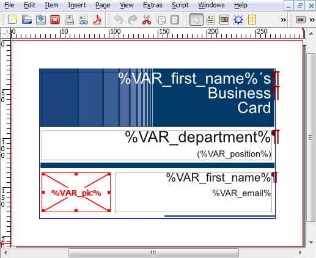
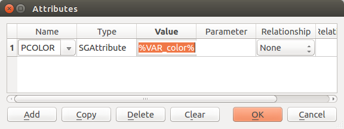

ScribusGenerator
================

Mail-Merge-like extension to Scribus, to generate Scribus and pdf documents automatically from external data.

[ Scribus Generator: Create beautiful documents with data](https://github.com/berteh/ScribusGenerator/). Open source pdf template and mail-merge alternative.

What is Scribus Generator?
-------

[Scribus](http://www.scribus.net/)  comes with a broad set of page layout features and functionality. One feature missing is to replace text with data dynamically. This kind of feature you may already know as the typical __mail merge__ functionality in your preferred office application.

[**Scribus Generator**](https://github.com/berteh/ScribusGenerator/) provides this functionality. It allows you to:

- replace texts dynamically
- replace images dynamically
- change colors, position, text font or size dynamically
- generate separate PDF (or Scribus) files for each data entry, or a single file from all your data
- work directly in Scribus with a nice user interface, or from the command line
- use any data source (Excel, OpenOffice, MySQL, Notepad, ...) that can export to CSV.
- and much more...

    Generally speaking, **Scribus Generator** replaces text with data to automatically generate files (e.g. SLA, PDF). It has been originally written by [Ekkehard Will](http://www.ekkehardwill.de/sg/) and further extended by [Berteh](https://github.com/berteh/).

A [short *how to* video](https://www.youtube.com/watch/kMsRn38TOiQ) introduces this Scribus Generator. 6 first minutes for the basic overview, 12 last for some more advanced features.

[](https://www.youtube.com/watch/kMsRn38TOiQ)

How to install Scribus Generator ?
-------

[Download](https://github.com/berteh/ScribusGenerator/archive/master.zip) the script and uncompress it anywhere on the local machine. It can be placed with the standard extension scripts. On Windows platform this location would be ``SCRIBUS_INSTALL_DIRECTORY\share\scripts\``, on Ubuntu ``/usr/share/scribus/scripts/``.

**Scribus Generator** can then be started by choosing the script (``ScribusGenerator.py``) within the dialog: _«Scribus → Script → Execute Script»_, or from the [command line](#running-scribus-generator-from-the-command-line).

The graphical interface of Scribus Generator requires Tkinter to be installed in your Python setup. There is no extra dependency to run it from the [command line](#running-scribus-generator-from-the-command-line).


What about Scribus?
--------

[Scribus](http://www.scribus.net/) is a desktop publishing (DTP) application, which is free software and released under the GNU General Public License ([http://www.scribus.net](http://www.scribus.net/)).

It is available for Linux, Unix-like, Mac OS X, OS/2, and Microsoft Windows. Known for its broad set of page layout features, it is comparable to leading non-free applications such as Adobe PageMaker, PagePlus, QuarkXPress or Adobe InDesign.

Scribus is designed for flexible layout and typesetting and the ability to prepare files for professional quality image setting equipment. It can also create animated and interactive PDF presentations and forms. Example uses include writing small newspapers, brochures, newsletters, posters and books.


The Scribus "template" file
------

Create and design your Scribus file as any other. At the positions where you need to replace text with data, just add ``%VAR_name%`` where ``name`` is the column your  data file.

You can place the variable at any position within a Text Frame. Apply all format and style to the variable that you wish to apply to the final text.


The (csv) Data File
--------

**Scribus Generator** expects a CSV file (_Comma Separated Values_), which is very simple to create with a standard spread sheet editor (such as [LibreOffice](http://www.libreoffice.org/) or Excel): enter the data and save/export as CSV. Just make sure your CSV file is encoded in UTF-to have a full character set (accents, braille, math, cyrillic, symbols,...).


As you can see, the columns have the same ``name`` as variables (``%VAR_name%``) referenced in the Sribus file you have designed.

We recommend saving in UTF-8 encoding to enable the full set of accentuated characters, chinese, cyrillic, math symbols, arrows, braille, symbols and [many more](http://csbruce.com/software/utf-8.html). Simply copy-paste those for which you lack a keyboard combination.

To export well-formated CSV in UTF-8 encoding is easy as pie with OpenOffice or LibreOffice Calc, less so with Excel. If you are using excel you may be interested in this free add-in that provides good export/import features: http://www.csvio.net/

Run the Generator Script - Settings
---------

Run the script via the menu: ``Script > execute Script`` and launch ``ScribusGenerator.py``.

In the script dialog you can configure the input and output settings for **Scribus Generator**.


| Input Setting | explanation |
| ---- | ---- |
| **Scribus File** | Choose the Scribus File containing the variables to replace. Click ⏏ to open a file explorer, and ↺ to load the Scribus Generator settings from that file. |
| **Data File** | Choose the Data File containing the comma separated values. Click ⏏ to open a file explorer. |
| **Data Field Separator** | Character that delimitates data field in your CSV file, comma (,) by default. |
| **From - To** | To run Scribus Generator on a subset of your data mention the starting and/or last lines of this subset, not counting the header line. Simply leave empty to generate from the beginning (or to the last) data entry.|

| Output Setting | explanation |
| ---- | ---- |
| **Output Directory** | Choose the path to an existing directory where to save the result. Click ⏏ to open a file explorer. |
| **Output File Name** | You can use the same variables as defined in the Scribus File/Data File. You can also mix the variables with other characters. If you leave the field empty an index will be used. The index/resulting files will be sorted according to the occurrence of rows in the Data File. |
| **Save Settings** | Store the current Scribus Generator settings in the source SLA file, for future use. |
| **Merge in Single File** | Select to  generate a single output (SLA and/or PDF) file that combines all data rows. |
| **Ouput Format** | Choose the Output Format of the generated files, either PDF or Scribus. |
| **Keep Scribus Files** | Select to keep the generated Scribus Files. Otherwise they will be deleted after pdf generation. This option has no effect if you choose Scribus output format.|

Additional (more technical) options can be set to tailor the automatic recording of Scribus Generators actions in your system by editing the ```logging.conf``` file. You may, for instance, want to move the location of the log file (```scribusGenerator.log``` by default) to a directory that does not need admin rights to edit in Windows  (```C:\tmp\scribusGenerator.log```), or replace file-logging with your default system logger (SysLogHandler in Linux, NTEventLogHandler on Windows). All settings (and more) are described in the [Python logging documentation](https://docs.python.org/2/howto/logging.html).


Dynamic Images
------------

Images references can also be dynamically modified with **Scribus Generator**. See the [screencast video @6:10](https://www.youtube.com/watch?feature=player_detailpage&v=kMsRn38TOiQ#t=370).

All images supported by **Scribus** can be used. However, to work with ScribusGeneratr, they must all be located in a single folder containing all images. This folder can be located anywhere on your PC.

Add an Image Frame anywhere in the Scribus file (_«Scribus → Insert → Insert Image Frame»_) and open the dialog for getting an image (_e.g. right click Image Frame → Get Image..._ on selected frame). Within the dialog navigate to the folder containing the images, though there won't be any images selected. Instead, the variable will be inserted into the value field of the _File name_.


After confirming the dialog, no image is displayed in the Image Frame any longer, however the variable name can be seen.



The images file can be defined just like any other variable described in earlier. There just has to be a column with a column-name corresponding to the variable-name in the Scribus template file.


Dynamic Colors
---------------

Colors can be dynamically replaced just like text. See the [screencast video @8:31](https://www.youtube.com/watch?feature=player_detailpage&v=kMsRn38TOiQ#t=512), or simply 

1. edit the colors of your Scribus file (``edit > colours``) and rename the colors you want to replace with variable names (typically replace ``FromSVG#whatever`` with the now well known form ``%VAR_name%``).
1. define the colors you want to use in the final document, and use their Scribus names as values in your color data field. 


Dynamic Links
--------------

A clickable (web)link can be inserted on nearly any scribus object in 2 steps:

1. ``right-click > PDF Options``, activate ``Is PDF Annotation``
1. ``right-click > PDF Options > Annotation Properties``, select type ``External Web-Link`` and enter the target url, where you can obviously use variables to be subsituted too, as illustrated below.


Merged output - single document
------------
Instead of generating a single (sla or pdf) file for each data row, you can generate a single file that merges all these. Simply select the option accordingly to get the result illustrated below in a single Scribus (and/or pdf) file. If your document layout has multiple pages (double sided, or folded leaflet), it is important for Scribus Generator to be able to merge the files that your template has the same number of pages (or a multiple thereof). For instance, for a 3-fold document, your source sla should have 3, 6, or 9 pages (or any multiple of 3).


More advanced uses
-----------
Scribus Generator allows more tech-savvy users you to customize the generated documents even more, changing virtually any attribute of any object, such as the fill or outline color of a line, the color of some text, a line thickness, an object position,... See the [screencast video @13:13](https://www.youtube.com/watch?feature=player_detailpage&v=kMsRn38TOiQ#t=793).

For instance, to change dynamically the *font* of an object, add an *attribute* to it (_«righ-click on object → Attributes → Add »_). The **type** attribute must be set to [``SGAttribute``][1], it's **name** to the [object property][2] you want to change (in this case ``FONT``) and its **value** to the desired dynamic value (typically some ``%VAR_name%``).  Your data (CSV) file should then contain the font name to use in the column of the given variable, such as "Arial Regular" or "Courier New Bold".



To change the properties of a sub-element (such as one particular text line in a text frame), you may use the **parameter** field to define which sub-elements should receive the new property. Use ``*`` to modify all direct children, or any other [simplified XPATH expression][3] to modify only a subset.

### Selected examples of SGAttributes:

| Name | Type | Value | Parameter | Explanation 
| --- | --- | --- | --- | --- |
| ``FONT`` | ``SGAttribute`` | ``%VAR_font%`` | ``//ITEXT[2]`` | Font of the 2d text line in a frame, like "Arial Regular"
| ``FONTSIZE`` | ``SGAttribute`` | ``%VAR_size%`` | ``//ITEXT`` | Text size all text lines in a frame, like "14" 
| ``YPOS`` | ``SGAttribute`` | ``%VAR_top%`` |  | Margin from the top for vertical element position, like "22.04"


[1]: # "SGAttribute is short for 'Scribus Generator Attribute'"
[2]: http://wiki.scribus.net/canvas/File_Format_Specification_for_Scribus_1.4#Tags "Object property is expressed in the exact SLA syntax"
[3]: https://docs.python.org/2/library/xml.etree.elementtree.html#supported-xpath-syntax "The reduced set of XPATH expressions valid in the 'parameter' field is defined in the ElementTree XPath support documentation."

Running Scribus Generator from the command line
---------
It is possible to run Scribus Generator from the command line, and it's fast! Great to automate your workflow or integrate with other tools.

Please note only the SLA generation works from the command line. PDF generation is at the moment not suppoted from the Scribus Generator command line.

Find all needed information from the script help: ``./ScribusGeneratorCLI.py --help``

```
positional arguments:
  infiles               SLA file(s) to use as template(s) for the generation,
                        wildcards are supported

optional arguments:
  -h, --help            show this help message and exit
  -c CSVFILE, --csvFile CSVFILE
                        CSV file containing the data to substitute in each
                        template during generation. Default is scribus source
                        file(s) name with "csv" extension instead of "sla". If
                        csv file is not found, generation from this particular
                        template is skipped.
  -d CSVDELIMITER, --csvDelimiter CSVDELIMITER
                        CSV field delimiter character. Default is comma: ","
  -n OUTNAME, --outName OUTNAME
                        name of the generated files, with no extension.
                        Default is a simple incremental index.
  -o OUTDIR, --outDir OUTDIR
                        directory were generated files are stored. Default is
                        the directory of the scribus source file. outputDir
                        will be created if it does not exist.
  -m, --merge, --single
                        generate a single output (SLA) file that combines all
                        data rows, for each source file.
  -from FIRSTROW, --firstrow FIRSTROW
                        Starting row of data to merge (not counting the header
                        row), first row by default.
  -to LASTROW, --lastrow LASTROW
                        Last row of data to merge (not counting the header
                        row), last row by default.
  -s, --save            Save current generator settings in (each) Scribus
                        input file(s).
  -l, --load            Load generator settings from (each) Scribus input
                        file(s). Overloads all options (but -h).

requirements
    This program requires Python 2.7+

examples:
    
  ScribusGeneratorCLI.py my-template.sla
    generates Scribus (SLA) files for each line of 'my-template.csv'
    by subsituting the provides values into 'my-template.sla' to the 
    current directory.

  ScribusGeneratorCLI.py --outDir "/home/user/tmp" example/Business_Card.sla 
    generates Scribus files for each line of example/Business_Card.csv
    in the "/home/user/tmp" subdirectory.

  ScribusGeneratorCLI.py --outName "card_%VAR_email%"  */*.sla 
    generates Scribus files for each sla file in any subdirectory
    that has a csv file with a similar name in the same directory.
    Generated files will have a name constructed from the "email" field
    data, and are stored in their respective sla file directory.

  ScribusGeneratorCLI.py --single -c translations.csv -n doc_  lang/*.sla 
    generates a single Scribus file for each sla file in the lang/ subdirectory
    using all rows of the translations.csv data file.
    Generated files will have a name constructed from the "doc_" prefix
    and the input sla file name.

 more information: https://github.com/berteh/ScribusGenerator/
```

More details
-------

### Clean output

Scribus Generator will remove unused variables from the generated documents, along with their containing text frame if that text frame contained nothing but variable(s).


If you want to keep these unused variables and empty texts, simply change the default setting accordingly in ```ScribusGeneratorBackend.py```, setting ```CLEAN_UNUSED_EMPTY_VARS``` to 0.

Similarly, if these unused variables or empty texts were _preceded_ by a simple text (such as a single linefeed, or a character like any of ```,;-```), these list-like separators will be removed, so you can have a clean enumaration by appending your variables in a simple manner such as ```%VAR_n1%, %VAR_n2%, %VAR_n3%, %VAR_n4%.```, or in a more tabular layout using  (single) linefeeds:
```
The following will show nicely even if some variable is empty or missing:
%VAR_n1%
%VAR_n2%
%VAR_n3%
%VAR_n4%
```

If you want to keep these separators, simply change the default setting accordingly in ```ScribusGeneratorBackend.py```, setting ```REMOVE_CLEANED_ELEMENT_PREFIX``` to 0.

**Linebreaks** and **tabulations** in your csv data are replaced by the scribus equivalent (newlines and tabulations). To remove them and turning them to simple spaces set the setting ```KEEP_TAB_LINEBREAK``` to 0.

### Logging and debug

ScribusGenerator records all its actions in a log file located (by default) in your user (home) directory. If you encounter an unexpected behaviour check out the content of ```.scribusGenerator.log``` to find out more. You can change the logging settings in logging.conf (see [Python log configuration](https://docs.python.org/2/howto/logging.html#configuring-logging) for more options).

Kindly copy-paste the relevant (usually last) lines of your ```.scribusGenerator.log``` if you want to [report an issue](https://github.com/berteh/ScribusGenerator/issues).

### Variable Names

Try to use plain word characters (``A-Za-a0-9_``) for variable names, with no whitespaces or other special characters (like '&'). E.g. use ``%VAR_first_name%`` and ``%VAR_zip_code%`` instead of ``%VAR_first name%`` and ``%VAR_&zip#code%``. The columns of the data file (CSV) then would be ``first_name`` and ``zip_code``.  

This is only important for variable *names* in the scribus file and *column names* of the data file. The data FIELDS (the rows of the CVS) of course may contain ANY characters.

### Database source

To use data from a database instead a (manual) spreadsheet you can simply export the related query result to a csv file. Some examples below for common database engines:

#### Mysql:

```mysql --delimiter="," -u myuser -p mydb -e "select f1,f2 from mytable" > /tmp/mydata.txt```

or

    mysql  -u myuser -p  mydatabase -e 
    "select field1 , field2 FROM mytable INTO OUTFILE 
    '/tmp/myfilename.csv' FIELDS TERMINATED BY ','
    ENCLOSED BY '\"' LINES TERMINATED BY '\n' "
    
More over INTO OUTFILE at http://dev.mysql.com/doc/refman/5.1/en/select.html

#### Postgresql

toggle unaligned output with the ```\a``` switch, activate a comma as a separator with ```\f ,```. Send output to a file with ```\o myfile.csv```, then query your database.
 
#### Sqlite3

You can use ```sqlite3 -csv``` in command line or ```.mode csv``` in sqlite's interactive shell

Known Issues
-------
### Mac OSX troubleshooting

Some install of Python on Mac OSX do not ship a working Tkinter package, that is required for ScribusGenerator GUI. Either find a way to setup a compliant TCL/Tk environment, or simply use the [Scribus Generator command line interface](#running-scribus-generator-from-the-command-line).

If you would like to contribute another GUI to Scribus Generator that works in Mac OSX don't hesitate! Simply [fork, branch, code and pull a request](https://guides.github.com/activities/contributing-to-open-source/#contributing) to get your contribution reviewed !

Support
--------
Check out the [wiki](https://github.com/berteh/ScribusGenerator/wiki) for more ideas, look at the [solved](https://github.com/berteh/ScribusGenerator/issues?q=is%3Aissue+is%3Aclosed) and [open issues](https://github.com/berteh/ScribusGenerator/issues), and then kindly report an [issue](https://github.com/berteh/ScribusGenerator/issues) online, and copy there the few last lines of your log file (it's ```.scribusGenerator.log```, inside your user (home) directory, to help find the reason of this bad behaviour, along with a short explanation of your problem.


Licence
--------

The MIT License<br/>
Copyright <br/>
(c) 2011, Ekkehard Will (www.ekkehardwill.de)<br/>
(c) 2014-2016, Berteh (https://github.com/berteh/)

Permission is hereby granted, free of charge, to any person obtaining a copy of this software and associated documentation files (the "Software"), to deal in the Software without restriction, including without limitation the rights to use, copy, modify, merge, publish, distribute, sublicense, and/or sell copies of the Software, and to permit persons to whom the Software is furnished to do so, subject to the following conditions: 

The above copyright notice and this permission notice shall be included in all copies or substantial portions of the Software. 

The software is provided "as is", without warranty of any kind, express or implied, including but not limited to the warranties of merchantability, fitness for a particular purpose and noninfringement. In no event shall the authors or copyright holders be liable for any claim, damages or other liability, whether in an action of contract, tort or otherwise, arising from, out of or in connection with the software or the use or other dealing in the software.
