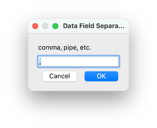

ScribusGeneratorMac.py
======================

### macOS Issues

Until now Mac OSX and macOS users of Scribus Generator have had to use the CLI (Command Line Interface) version of the script and run it in Terminal, because the original GUI version requires Tkinter (TCL-tK) to be installed in your Python setup, which is difficult on Macs.

Even if you have Tkinter installed and configured for Python on your Mac the Scribus app may not be able to find it if it is installed via Homebrew, Macports, or Fink in a non-standard location.  There also appears to be no way to tell Scribus where Python is actually installed on your Mac.

The ScribusGeneratorMac.py script now offers Mac users a GUI version that uses the Scribus Plugin API instead of Tkinter. This script should also work on Windows and Linux systems that don't have Tkinter.

How to use Scribus Generator
------

Please refer to the [Scribus Generator Documentation](https://github.com/berteh/ScribusGenerator/wiki) for details on how to prepare your template and data files.

Running the Mac Generator Script - Settings
---------

Run the script via the menu: ``Script > execute Script`` and launch ``ScribusGeneratorMac.py``.

In the script dialogs you can configure the input and output settings for **Scribus Generator**.

The Mac version of the script uses the Scribus Plugin API which has support for a *very* limited GUI. It cannot create a single settings window like the Tkinter version does, so you will instead have to enter and confirm your settings in a series of dialog boxes.


This dialog just lets you know that Scribus Generator is now running, and tells you that you will be presented with a series of dialogs.  Press the "OK" button to continue.


Use the File Dialog to navigate to where ever your Scribus .sla template file is located.  Upon loading the file it is immediately checked to see if there are any previously saved settings associated with it (these are stored IN the .sla file, by the way). If there are saved settings you will see this dialog:


If you select "No" the saved settings will be ignored. If you select "Yes" it will show you what the saved settings are so you can decide whether or not you want to use them:


Again, you have an opportunity to either LOAD and USE those settings, in which case the script will *skip* the rest of the dialogs and immediately try to process the data merge operation.  If those are not settings you wish to use select "No" and it will proceed with the rest of the settings dialogs:


Use the File Dialog to navigate to where your Data File is located.  This would normally be a CSV (Comma Separated Values) file, but it might also be a TSV (Tab Separated Values) or plain Text file or some other kind of data file.



You will then be asked what character is being used as the Data Separator.  In a CSV file this would normally be a comma (,) but it might be a colon (:) or a semi-colon (;) or a pipe (|) or a space or a tab (\t) which is common when exporting data from Microsoft Excel.


In order to properly process the Data File the Scribus Generator script needs to know what character encoding the file uses. This would typically be Unicode (UTF-8) but it might be something else depending on what characters/language the data is.


(Optional) Normally Scribus Generator will use ALL of the records in your Data File from the first to to the last. But you can also direct it to use only a selection of the data in the file. If you answer "Yes" to this dialog you will be asked which rows/records comprise the data selection:


Enter a number corresponding to the Row/Record in the Data File.


Next you'll be asked where the generated files should be saved?  Use the File Dialog to select the location of the Output Directory.


(Optional) In this dialog box you enter the Output File Name without the file extension.  You can also leave it blank and Scribus Generator will create a filename based on an incremented number of how many ever records are processed.  Alternatively you can also include in the file name one of the variables (the column headers of your Data File) that contains unique data, and use that to name the output files.


The only two valid entries in this dialog are either "PDF" or "SLA" (all uppercase).  If you select PDF both .sla and .pdf files are created, if you select SLA only .sla files will be created. Whether you end up with multiple files or ONE file depends on your answer to the *next* dialog:


If you answer "Yes" to this dialog you will end up with only one or two files at the end of the generation process, depending on what you answer to the next dialog.  If you answer "No" to this dialog Scribus Generator will produce individual files for each record in your Data File.


The Scribus .sla files, one for each record in your Data File, are used to create the PDF file(s). Normally the individual .sla files are deleted at the end of the process unless you specify that they should be kept.  If you opted to "Merge" files the .sla files are merged into one .sla file and the .pdf files are merged into one PDF file.  If you selected PDF output and answered "No" to keeping Scribus files, you will end up with only a single PDF file at the end of the process.


The default is for Scribus Generator to close after it finishes processing this job successfully.  However, if you plan to immediately generate additional documents with other settings answer "Yes" to this dialog and after *this* job successfully completes the script will automatically ask you for the next Scribus template for another job.


If you would like to SAVE these settings answer "Yes" to this dialog. It will save the settings IN the Scribus template .sla file. If the file already has settings saved in it, this will overwrite them with the current settings.

*NOTE: Answering "No" will not remove saved settings from the Scribus file.


This dialog is where you confirm you want to run Scribus Generator with the current settings.  If all goes well you might see the documents being processed automatically in Scribus before you get this next dialog:


If the processing was successful you'll see this confirmation box that the process is "Done" and where your generated file(s) are located.  If you opted to "Close Generator" there will only be an "OK" button on this dialog and when you process it Scribus Generator closes and you go back to the Scribus editor. 

If you chose to keep Generator running you will be presented with be presented with both "Cancel" and "OK" buttons. If you press "OK" you will be prompted for the .sla template file for another data operation.  If you press "Cancel" you will exit Scribus Generator to the editor.


At numerous steps along the way if you pressed the "Cancel" button you will see the "Scribus Generator operation aborted!" warning dialog and the script will exit you back to the Scribus editor.

Support
--------
Check out the [wiki](https://github.com/berteh/ScribusGenerator/wiki) for more ideas, look at the [solved](https://github.com/berteh/ScribusGenerator/issues?q=is%3Aissue+is%3Aclosed) and [open issues](https://github.com/berteh/ScribusGenerator/issues), and then kindly report an [issue](https://github.com/berteh/ScribusGenerator/issues) online, and copy there the few last lines of your log file (it's ```.scribusGenerator.log```, inside your user (home) directory, to help find the reason of this bad behaviour, along with a short explanation of your problem.


Licence
--------

The MIT License<br/>
Copyright <br/>
(c) 2011, Ekkehard Will (www.ekkehardwill.de)<br/>
(c) 2014-2024, Berteh (https://github.com/berteh/)

Permission is hereby granted, free of charge, to any person obtaining a copy of this software and associated documentation files (the "Software"), to deal in the Software without restriction, including without limitation the rights to use, copy, modify, merge, publish, distribute, sublicense, and/or sell copies of the Software, and to permit persons to whom the Software is furnished to do so, subject to the following conditions:

The above copyright notice and this permission notice shall be included in all copies or substantial portions of the Software.

The software is provided "as is", without warranty of any kind, express or implied, including but not limited to the warranties of merchantability, fitness for a particular purpose and noninfringement. In no event shall the authors or copyright holders be liable for any claim, damages or other liability, whether in an action of contract, tort or otherwise, arising from, out of or in connection with the software or the use or other dealing in the software.
